	

	
	

	

	<h2>👨🏻‍💻 About Me</h2>
	
💼 IT Specialist  from England, UK.

 	
🎓 Holder of a First Class Honours Bachelor of Science (BSc) in Computer Science as well as certifications from Microsoft, AWS and other vendors.

  	
🔭 My interests include Networking, Cyber Security, Web and Software Development.

	
🐙 I like to share projects I develop during my free time.

	
📫 Connect with me <a href="https://robsd.github.io">here</a>.

	<h2>❤️ Support Me</h2>
	
If you like or use any of my repos, please star ⭐ them and consider supporting me below...

	<table>
		<tr>
			<td>
				
			</td>
			<td>
				
			</td>
		</tr>
	</table>

	<h2>🛠 Languages and Tools</h2>
	
	
	
	
	
	
	
	
	
	
	
	
	
	
	
	
	
	
	
	
	
	
	
	
	

	<h2>📈 GitHub Stats</h2>
	<table>
		<tr>
			<td>
				
			</td>
			<td>
				
			</td>
		</tr>
	</table>

	<h2>👀 Other Stats</h2>
	<table>
		<tr>
			<td>
				
			</td>
			<td>
				
			</td>
		</tr>
		<tr>
			<td>
				

					
				

				

					
				

			</td>
			<td>
				

					
				

			</td>
		</tr>
	</table>

<!--
Cool stuff that didn't make the cut 😭
---

-->
